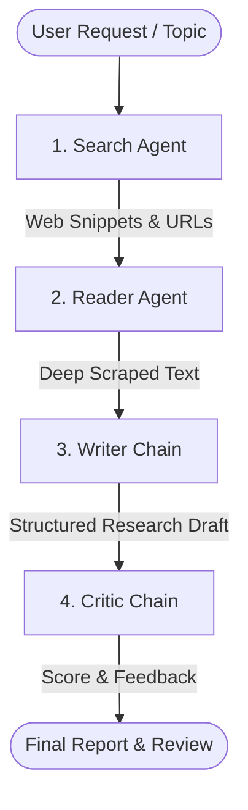

# 🔎 Multi-Agent AI Research Assistant

An autonomous multi-agent research workflow powered by **LangChain**, **Mistral AI (`ChatMistralAI`)**, **Tavily Search**, **BeautifulSoup4**, and **Streamlit**.

Given any research topic, this application orchestrates a team of specialized AI agents and chains to automatically search the web, scrape deep article content, synthesize a structured report, and critically evaluate the final output.

---

## 🌟 Key Features

- 🔍 **Autonomous Web Search Agent**: Uses Tavily API to gather relevant, high-quality search snippets and source URLs.
- 📚 **Deep Reader & Scraper Agent**: Automatically picks the most relevant URL and extracts clean body text using BeautifulSoup4.
- ✍️ **Research Writer Chain**: Synthesizes search results and scraped text into a professional 500–800 word structured Markdown report.
- 🧐 **Critical Review Agent**: Evaluates the drafted report on clarity, factual depth, completeness, and engagement, assigning a numerical score out of 10 along with key strengths and areas to improve.
- 💻 **Streamlit Web UI & CLI**: Run interactively in your browser with real-time status updates and downloadable `.md` reports, or directly from the terminal.

---

## 🏗️ Architecture & Agent Workflow



1. **Step 1: Search Agent (`build_search_agent`)** — Invokes `web_search` tool (Tavily API) to find fresh information.
2. **Step 2: Reader Agent (`build_reader_agent`)** — Invokes `scrape_url` tool (Requests + BeautifulSoup4) to extract full article text.
3. **Step 3: Writer Chain (`writer_chain`)** — Generates a report with Introduction, Key Findings (minimum 3 points), Conclusion, and Sources.
4. **Step 4: Critic Chain (`critic_chain`)** — Performs a strict evaluation of the report's accuracy, structure, and engagement.

---

## 📂 Project Structure

```text
├── agents.py          # Mistral LLM setup, Agent definitions & LCEL Writer/Critic chains
├── app.py             # Streamlit web interface with tabbed results and live progress
├── pipeline.py        # Core sequential research pipeline orchestrator & CLI entrypoint
├── tools.py           # Custom LangChain tools (Tavily search & BeautifulSoup web scraper)
├── requirements.txt   # Project dependencies
└── .env               # API Key configuration (TAVILY_API_KEY, MISTRAL_API_KEY)
```

---

## 🛠️ Technology Stack

- **Framework**: LangChain (`langchain`, `langchain-community`, `langchain-mistralai`)
- **LLM**: Mistral AI (`mistral-small-latest`)
- **Search Engine**: Tavily API
- **Web Scraping**: BeautifulSoup4 & Requests
- **User Interface**: Streamlit
- **Environment Management**: `python-dotenv`

---

## 🚀 Getting Started

### 1. Prerequisites

- Python 3.10 or higher
- A **Mistral AI API Key** ([Get one here](https://console.mistral.ai/))
- A **Tavily API Key** ([Get one here](https://tavily.com/))

### 2. Installation

1. **Clone or download the repository**:
   ```bash
   git clone <repository-url>
   cd Multi-agent-AI
   ```

2. **Create and activate a virtual environment**:
   ```bash
   # On Windows PowerShell
   python -m venv .venv
   .\.venv\Scripts\Activate.ps1

   # On macOS/Linux
   python3 -m venv .venv
   source .venv/bin/activate
   ```

3. **Install required dependencies**:
   ```bash
   pip install -r requirements.txt
   ```

### 3. Environment Configuration

Create a `.env` file in the root directory of the project:

```env
TAVILY_API_KEY=your_tavily_api_key_here
MISTRAL_API_KEY=your_mistral_api_key_here
```

---

## 💻 Usage

### Launching the Streamlit Web Application

Run the following command to start the web app:

```bash
streamlit run app.py
```

- Open your browser at `http://localhost:8501`.
- Type your research topic in the input field (e.g., *"Latest advances in solid-state batteries"*).
- Click **Run Research Pipeline** to watch the status updates and view the results in interactive tabs.
- Download the generated report as a `.md` file with a single click.

### Running via Terminal (CLI)

You can also run the research pipeline directly in your terminal:

```bash
python pipeline.py
```

Enter your research topic when prompted to see step-by-step console outputs.

---

## 📄 License

This project is open-source and available under the [MIT License](LICENSE).
